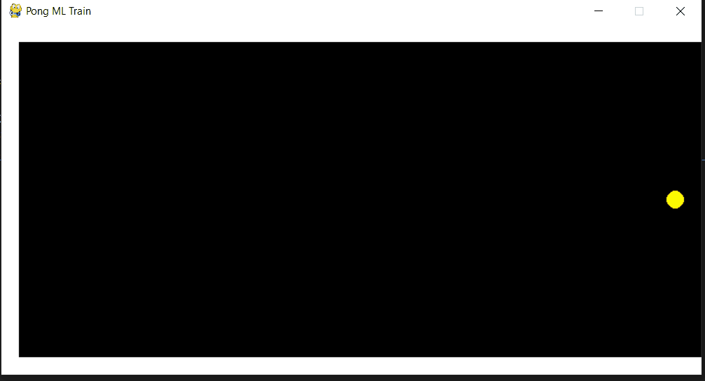

# Pong Lab: ML Player

## Introduction
Create an AI agent for the single player Pong-like game.

In this program, I used the KNeighborsClassifier model to train the ai agent. 
##Result
Here is the 3 consecutive games result: 

Round 1 over. 
Time: 13.06 sec

Round 2 over. 
Time: 143.03 sec

Round 3 over. 
Time: 32.81 sec

The average for 1 round is 62 sec.

## Example
Here is a models from the training sets playing solo:

